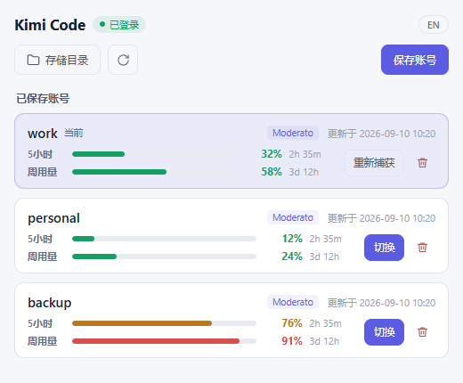

# multi-kimi

[English](README.en.md) | 简体中文

multi-kimi — 一个桌面小工具，用于在多个 **Kimi Code** 账号之间一键切换登录凭据，并随时查看每个账号的用量。

## 界面预览

*截图使用示例账号与用量数据。*

## 功能

- **多账号切换**：保存任意多个账号（如 `work` / `personal`），点一下即可切换，无需重新登录；
- **用量查看**：每个账号卡片显示 5 小时用量、周用量与重置倒计时，随时手动刷新；
- **托盘常驻**：关闭窗口后驻留系统托盘，双击图标随时唤起；
- **切换保护**：切换时自动同步 CLI 运行期间的凭据更新，避免把过期凭据写回去导致失效；
- **本地存储**：凭据只在本机两个目录之间复制，不经过任何第三方；用量查询仅请求 Kimi 官方接口；
- **隐私安全**：界面与日志绝不显示凭据内容；存储目录与文件均为本机私有权限。

## 下载

从 [Releases](../../releases) 下载对应平台的桌面程序：

| 平台 | 文件 |
| --- | --- |
| Windows x64 | `multi-kimi-*-windows-amd64.exe` |
| Windows ARM64 | `multi-kimi-*-windows-arm64.exe` |
| macOS Intel | `multi-kimi-*-darwin-amd64.app.zip` |
| macOS Apple Silicon | `multi-kimi-*-darwin-arm64.app.zip` |

macOS 首次打开若被拦截，可在访达中右键应用选择「打开」，或在「系统设置 → 隐私与安全性」中允许。

## 使用

1. 在终端用 `kimi login` 正常登录第一个账号；
2. 打开 multi-kimi，点「保存」，给账号起个名字（如 `work`）；
3. 在 CLI 里退出登录，换另一个账号登录，再保存一次（如 `personal`）；
4. 之后随时在工具里点「切换」，即可在账号之间自由切换，无需再次登录。

其他操作：

- **重新捕获**：用当前登录凭据刷新某个账号的快照（登录凭据被换成其他账号时工具会提示）；
- **刷新用量**：点卡片头部的刷新按钮，更新全部账号的用量；
- **删除**：只删除本地快照，不影响当前登录状态；
- **存储目录**：在资源管理器 / 访达中打开本地存储目录。

## 数据与安全

- 账号快照保存在本机 `~/.multi-kimi/`，当前登录凭据仍在 CLI 自己的目录中，互不影响；
- 所有数据只在本机保存与传输到 Kimi 官方接口，没有任何第三方服务；
- 若检测到可能绕过凭据文件的环境变量（如 `KIMI_CODE_HOME`），切换前会给出警告（只提示变量名）。
